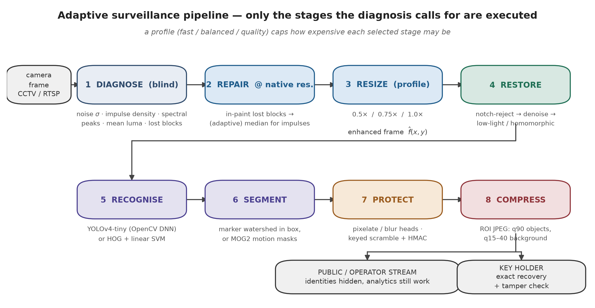
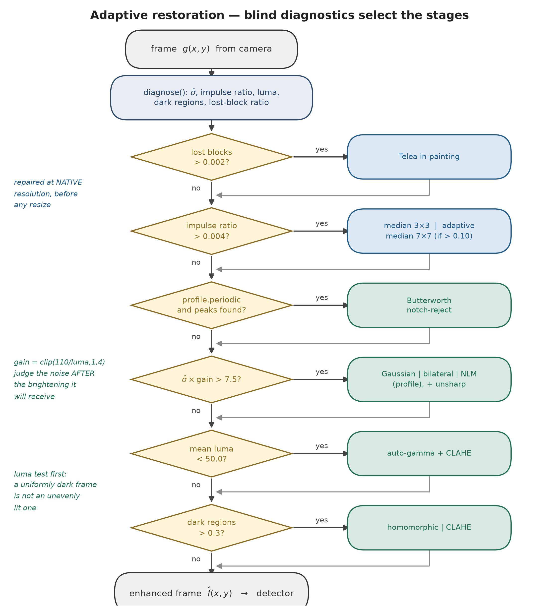
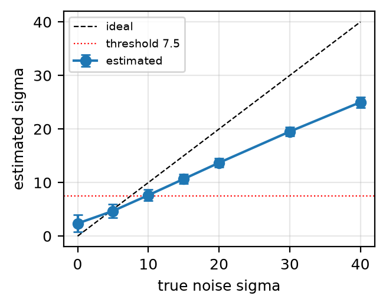
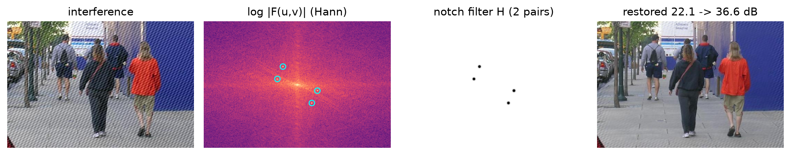
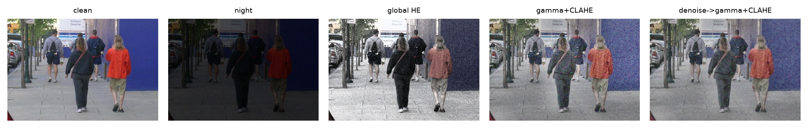
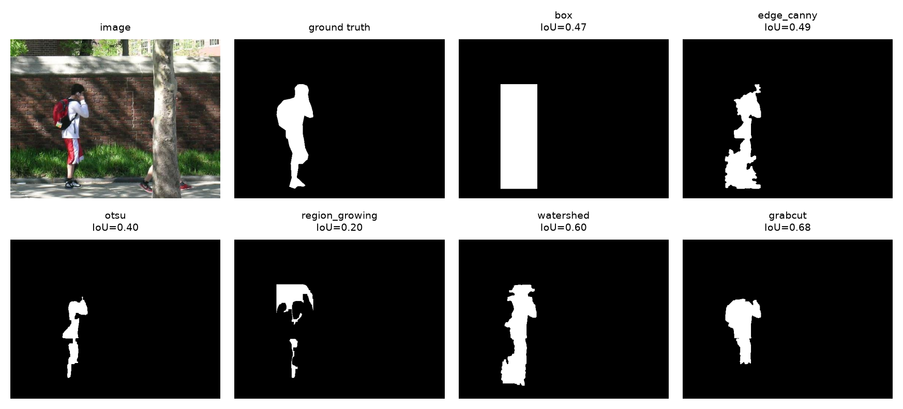
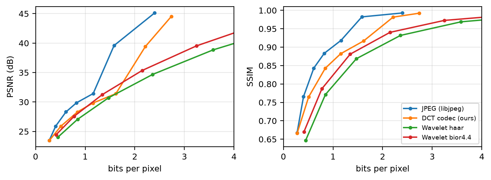
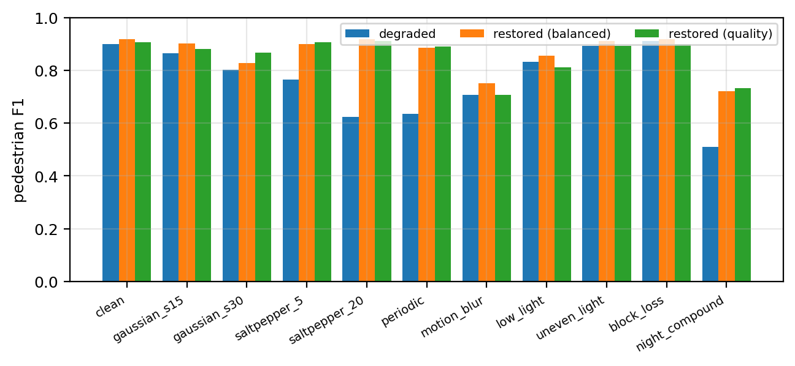
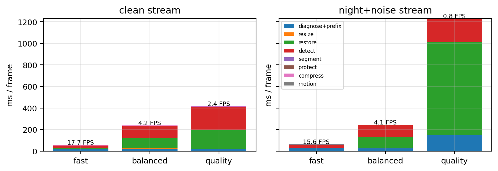
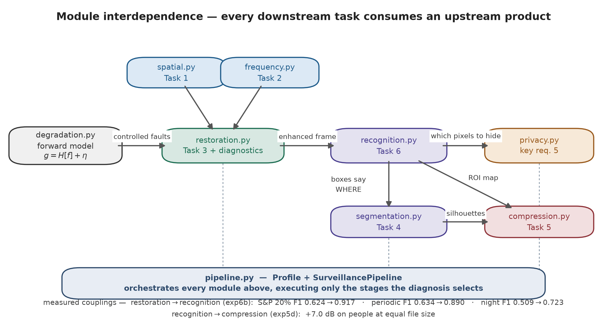

# Smart City Surveillance System

**An adaptive digital image processing pipeline for CCTV under noise, low light, interference, blur and transmission loss.**

Digital Image Processing · <https://github.com/U-LF/smart-surveillance-dip>

Islamabad's public-space surveillance network struggles with poor image quality, noisy
environments and varying lighting, which makes pedestrians and vehicles hard to identify. This
project attacks that as an *inverse problem* rather than a fixed filter chain: five blind
diagnostics measure every frame, and **only the restoration stages the diagnosis calls for are
executed**, with a profile capping how expensive each one may be.

Everything here is measured. Every number below is regenerated by `experiments/run_all.py` into
`results/tables/` and `results/figures/`, and the core operators are implemented from first
principles and verified against OpenCV and scikit-image by a 17-test suite.



---

## Table of contents

1. [Quick start](#1-quick-start)
2. [The adaptive pipeline](#2-the-adaptive-pipeline)
3. [Repository layout](#3-repository-layout)
4. [Datasets](#4-datasets)
5. [Results](#5-results)
6. [Module interdependence](#6-module-interdependence)
7. [Task coverage](#7-task-coverage)
8. [Verification and reproducibility](#8-verification-and-reproducibility)
9. [Limitations](#9-limitations)
10. [References and credits](#10-references-and-credits)

---

## 1. Quick start

```bash
python -m venv .venv && source .venv/bin/activate      # Windows: .venv\Scripts\activate
pip install -r requirements.txt
python scripts/download_data.py --all                  # ~152 MB, verified, with fallback mirrors
python -m pytest -q tests                              # 17 correctness tests
```

Then reproduce everything, or run the live demo:

```bash
python experiments/run_all.py --quick     # smoke test, ~5 min
python experiments/run_all.py             # full result set
python experiments/run_all.py exp6        # a single experiment
python scripts/make_diagrams.py           # regenerate the design figures
python scripts/summarize_results.py       # print every headline number

python demo.py --source data/videos/vtest.avi --degrade night_compound --profile balanced
python demo.py --source 0 --show          # webcam, live window
```

No GPU and no PyTorch are required. Tested on Python 3.10–3.14 with OpenCV 4.14 and NumPy 2.5.

> **OpenCV must be 4.x.** OpenCV 5.0 removed `HOGDescriptor` and the Darknet loader used by
> YOLOv4-tiny. If you see `module 'cv2.dnn' has no attribute 'readNetFromDarknet'`, run
> `pip uninstall -y opencv-python && pip install "opencv-python>=4.8,<5"`.

---

## 2. The adaptive pipeline

The system does **not** run every filter on every frame. Blind diagnostics decide *which*
restoration is needed; a **profile** decides how expensive each chosen operation may be.



| profile | resolution | impulse | denoise | periodic | illumination | detector | segmentation |
|---------|-----------:|---------|---------|:--------:|--------------|----------|--------------|
| `fast` | 0.5× | median 3×3 | Gaussian | – | gamma | YOLO@320, every 3rd frame | MOG2 masks |
| `balanced` | 0.75× | median 3×3 | bilateral | ✓ | gamma+CLAHE | YOLO@416 | watershed in box |
| `quality` | 1.0× | adaptive median | NLM + unsharp | ✓ | + homomorphic | YOLO@608 | watershed in box |

The thresholds printed on the flowchart are read from `surveillance/pipeline.py` when the figure
is drawn, so the diagram cannot drift from the code.

### Three deliberate orderings

| Ordering | Why | Evidence |
|---|---|---|
| Repair impulses/lost blocks **before** resize | Area resampling averages an impulse into an undetectable local bias | design |
| Denoise **before** brightening, judged **after** gain | Enhancement multiplies intensities by ≈4×, amplifying noise; the trigger tests `σ̂ · gain` | **+2.2 dB** (exp3b) |
| Test mean luminance **before** uniformity | A uniformly dark frame and an unevenly lit one need opposite corrections | exp0 |

---

## 3. Repository layout

```
surveillance/          the library — one module per technical task
  config.py            paths, dataset URLs, checksums, thresholds
  degradation.py       noise / blur / low-light / interference / packet-loss models
  spatial.py           Task 1     frequency.py    Task 2     restoration.py  Task 3 + diagnostics
  segmentation.py      Task 4     compression.py  Task 5     recognition.py  Task 6
  privacy.py           anonymisation, keyed scrambling, HMAC
  metrics.py           PSNR · SSIM · IoU · Dice · P/R/F1 · AP50
  pipeline.py          the integrated adaptive system (Profile + SurveillancePipeline)
  datasets.py          Penn-Fudan, CAVIAR (CVML), video loaders
experiments/           exp0 … exp7 — every table and figure in the report
scripts/
  download_data.py     verified dataset + model acquisition, with mirrors
  make_diagrams.py     the design figures (pipeline, flowchart, interdependence)
  summarize_results.py prints every headline number from results/tables
tests/test_core.py     from-scratch code vs OpenCV / scikit-image
demo.py                live / video demo
report/                IEEE-format LaTeX report (main.tex, refs.bib, figures/)
results/tables/        csv + markdown + LaTeX for every experiment
results/figures/       png + pdf for every figure
```

---

## 4. Datasets

| Data | Used for | Source | Verification |
|------|----------|--------|--------------|
| **Penn-Fudan** (170 images, 423 mask instances) | PSNR/SSIM references, IoU/Dice, P/R/F1 | UPenn → GitHub mirror | 170/170/170 files |
| **CAVIAR** (5 sequences, 2 211 frames, CVML boxes) | real-CCTV detection, motion segmentation | Edinburgh + mirror | XML parses, >100 frames |
| **KITTI street clip** | vehicle robustness | Ultralytics assets | opens in OpenCV |
| **vtest.avi** (768×576) | real-time benchmark, ROI coding | OpenCV samples | opens in OpenCV |
| **YOLOv4-tiny** COCO weights | recognition | AlexeyAB/darknet | MD5 `8911bf80…` |

Everything downloads without an account, into `.part` files renamed only on completion, with
retries and integrity checks.

**Datasets considered but deliberately not used**, and why:
- **Cityscapes** — requires registered access and ~12 GB, which conflicts with "regenerable from
  one unattended download". An excellent fit otherwise.
- **Lahore Urban Traffic Observations** — tabular sensor data (flow counts, timestamps), not
  imagery, so no image-processing operator here can consume it.
- **Custom Face Mask dataset** — mask *classification* on tightly cropped faces, orthogonal to the
  six technical tasks and not representative of wide public-space surveillance geometry.

**Why synthetic degradations?** PSNR and SSIM need a clean reference that real night footage
cannot provide. Clean frames are degraded with the standard model *g = H[f] + η*
(`surveillance/degradation.py`) using seeded, documented parameters. The CAVIAR and KITTI
evaluations offset this by testing on genuine footage.

---

## 5. Results

### 5.1 Can each fault be detected blindly? (exp0, 60 images)

Five of six fault classes are flagged on **100 %** of degraded frames, with ≤ 5 % false alarms on
clean frames. Periodic interference is found 81.7 % of the time at amplitude 10, 98.3 % at 20 and
100 % at 40+.

| scenario | impulse | noise | periodic | dark | dark reg. | lost blocks |
|---|--:|--:|--:|--:|--:|--:|
| clean | 0 | 2 | 5 | 0 | 0 | 0 |
| gaussian σ=15 / σ=30 | 0 | **100** | 5 | 0 | 0 | 0 |
| salt & pepper 5 % / 20 % | **100** | 100 | 5 | 0 | 0 | 0 |
| periodic | 0 | 2 | **100** | 0 | 0 | 0 |
| low light | 0 | 0 | 3 | **100** | 0 | 0 |
| uneven light | 0 | 0 | 5 | 2 | *5* | 2 |
| block loss | 0 | 2 | 2 | 0 | 2 | **100** |
| night compound | **100** | 53 | 5 | **100** | 0 | 0 |

**Negative result:** uneven illumination is *not* separable from frame statistics — a clean scene
with ordinary shadows looks identical. Rather than tune the threshold until it appears to work, we
report it as unusable and expose homomorphic correction as a per-camera setting
(`illumination="always"`).



### 5.2 Spatial filtering (exp1, 40 images)

| scenario | degraded | best filter | PSNR | cheap alternative |
|---|--:|---|--:|---|
| Gaussian σ=15 | 24.77 | NLM (209 ms) | **28.51** | Gaussian 27.35 dB in **0.3 ms** |
| Gaussian σ=30 | 19.02 | **Gaussian (0.4 ms)** | **24.47** | NLM is *worse*: 24.28 |
| salt & pepper 5 % | 17.93 | adaptive median | **31.83** | median 3×3: 27.82 |
| salt & pepper 20 % | 11.92 | adaptive median | **29.42** | median 3×3: 24.97 |

Choosing the right filter *family* matters far more than choosing an expensive one. On 20 % impulse
noise, NLM — the most expensive filter available — reaches only 16.34 dB, **13 dB below** the
adaptive median, because an averaging filter cannot repair saturated outliers. Bilateral filtering
is worse still (12.12 dB): an impulse is exactly the large intensity difference its range kernel
is built to preserve.

Our from-scratch NumPy filters are **bit-identical** to OpenCV (max abs diff 0.00) and 5–305×
slower — median 3×3: 19.89 ms vs 0.07 ms.

### 5.3 Frequency-domain filtering (exp2, 30 images)



Automatic notch rejection gains **+12.5 dB** (22.30 → 34.78 dB, SSIM 0.530 → 0.943) where the best
global low-pass manages +1.1 dB. Periodic interference is delocalised in space but compact in
frequency, so a spatial smoother must destroy the signal to attenuate it.

Low-pass families rank Gaussian > Butterworth > ideal at every cut-off (24.07 / 23.59 / 22.79 dB at
D₀=0.10). At D₀=0.05 the **ideal filter is worse than no filtering at all** (20.33 vs 20.49 dB):
its ringing costs more than the noise it removes.

Homomorphic filtering is the only method that raises SSIM on uneven lighting (0.902 → **0.922**);
CLAHE matches it on PSNR but *lowers* SSIM to 0.859, and global HE is worse than doing nothing.

Frequency and spatial Gaussian filtering agree to 57–59 dB (round-off), but the spatial form is
24–290× faster, so the DFT is reserved for operations with no compact spatial equivalent.

### 5.4 Restoration and reconstruction (exp3, 30 images)

| fault | degraded | best method | restored |
|---|--:|---|--:|
| motion blur 15 px + noise | 22.49 | Wiener K=0.01 (inverse filter: **6.67**) | **25.52** |
| night / low light | 8.60 | denoise → gamma+CLAHE (reverse order: 16.15) | **18.37** |
| 3 % blocks lost | 21.60 | Telea in-painting (median 5×5: **20.08**) | **35.00** |

Three failure modes worth reporting:
- The **inverse filter** returns 6.67 dB — *15.8 dB worse than the blurred input*. Adding the
  single term `K` to the denominator turns it into 25.52 dB.
- **Wiener needs the PSF.** ±20 % error costs 2.1–4.6 dB; a 40 % over-estimate (17.86 dB) is worse
  than the blurred input. No blind PSF estimator is implemented, so the pipeline does not deconvolve.
- **Median filtering packet loss is harmful** (20.08 dB vs 21.60 dB degraded): it smears black
  blocks outward. Reconstruction needs to know *which* pixels are missing.

**Order matters:** denoise → enhance gives 18.37 dB / SSIM 0.658; the same two operations reversed
give 16.15 dB / 0.526.



### 5.5 Segmentation (exp4, 100 images)

| method | family | IoU (GT boxes) | IoU (YOLO boxes) | ms |
|---|---|--:|--:|--:|
| box (baseline) | — | 0.497 | 0.473 | 0.1 |
| Canny + morphology | edge | 0.286 | 0.276 | 4.3 |
| Sobel + Otsu | edge | 0.201 | 0.179 | 4.3 |
| Otsu | region | 0.426 | 0.404 | 6.2 |
| region growing | region | 0.544 | 0.526 | 838 |
| **watershed** | region | **0.692** | **0.632** | **3.5** |
| GrabCut | region | 0.642 | 0.588 | 401 |

Region-based methods dominate edge-based ones on cluttered streets, and the best method is also the
cheapest competitive one: watershed is **115× faster than GrabCut and more accurate**, because a
well-placed marker pair encodes the prior GrabCut must infer by iteration. Only watershed and
region growing beat the trivial "fill the box" baseline.

**Negative result:** denoising before segmentation does *not* help. Watershed on σ=30 noise scores
0.541; balanced restoration recovers only to 0.560, and NLM makes it **worse** (0.513). Strong
denoisers remove the weak gradients segmentation depends on.



On real CAVIAR footage, background subtraction reaches F1 0.457–0.475 (MOG2) and 0.475–0.554
(from-scratch running average) at ~1 ms/frame. MOG2 is more precise (0.82–0.97) but less sensitive,
because its mixture model absorbs a person who pauses into the background.

### 5.6 Compression (exp5)



At 1 bpp: libjpeg 30.69 dB, our from-scratch DCT codec 29.07 dB (same quantiser — the gap is the
entropy coder), bior4.4 wavelet 29.02 dB, Haar 27.96 dB.

**Task-aware fidelity:** pedestrian F1 is essentially unchanged down to JPEG q=40 (0.95 bpp, a 25×
reduction) and collapses below q=10. Fidelity the analytics cannot perceive is worth discarding.

**ROI coding** gains only +0.5 dB on Penn-Fudan close-ups, where people already fill the frame, but
**+7.0 dB on people at equal file size in the wide CCTV view** where they cover 4.5 % of the pixels.
The value of ROI coding is a function of how small the objects are.

### 5.7 Object recognition (exp6, all 170 images, 423 instances)

| detector | Precision | Recall | F1 | AP50 | ms |
|---|--:|--:|--:|--:|--:|
| HOG + linear SVM | 0.666 | 0.508 | 0.576 | 0.427 | 5.8 |
| YOLOv4-tiny @320 | 0.838 | 0.941 | 0.886 | 0.919 | 11.6 |
| **YOLOv4-tiny @416** | 0.855 | 0.960 | **0.904** | **0.926** | 16.1 |
| YOLOv4-tiny @608 | 0.724 | 0.917 | 0.809 | 0.807 | 27.8 |

**The largest input size is not the most accurate.** Going 416 → 608 px drops F1 from 0.904 to
0.809: recall barely moves while false positives more than double (69 → 148). The most expensive
setting is not merely poor value — it is actively worse.

#### Restoration → recognition (the key interdependence result)

| scenario | raw | + balanced | + quality |
|---|--:|--:|--:|
| clean | 0.900 | 0.917 | 0.906 |
| Gaussian σ=30 | 0.803 | 0.828 | **0.867** |
| salt & pepper 20 % | 0.624 | **0.917** | 0.910 |
| periodic | 0.634 | 0.885 | **0.890** |
| motion blur | 0.706 | **0.750** | 0.706 |
| night compound | 0.509 | 0.722 | **0.723** |

Restoration never harms the clean stream and recovers most of the loss on every fault. Vehicles on
the KITTI clip: Gaussian 0.614 → 0.783, S&P 0.716 → 0.826, periodic 0.567 → 0.809.



#### Real CCTV: where the system actually fails

| CAVIAR sequence | median person height | HOG | YOLO@416 | YOLO@608 |
|---|--:|--:|--:|--:|
| EnterExitCrossingPaths1cor | 65 px | 0.129 | **0.943** | 0.930 |
| OneLeaveShop1cor | 61 px | 0.038 | **0.820** | 0.798 |
| Meet_Crowd | 26 px | 0.000 | 0.017 | 0.050 |
| Fight_Chase | 21 px | 0.000 | 0.013 | 0.050 |
| Walk1 | 18 px | 0.000 | 0.062 | 0.097 |

F1 correlates almost perfectly with **pedestrian pixel height**, not with noise or lighting. Below
~30 px every detector collapses, and no amount of restoration recovers a person 20 px tall. This is
invisible on Penn-Fudan, whose pedestrians are hundreds of pixels tall, and it is the single most
important practical finding here: **camera placement dominates algorithm choice.**

#### Privacy vs accessibility

Pixelating heads keeps pedestrian F1 at 0.877 (0.900 unprotected) and blurring at 0.872, so
counting and tracking still work on the public stream. Pixelating whole bodies drops it to 0.026.
The keyed scrambler restores the original bit-exactly for key holders.

### 5.8 Real-time performance and resources (exp7, 768×576, full pipeline)

| profile | FPS clean | FPS night+noise | restore ms | detect ms |
|---|--:|--:|--:|--:|
| `fast` | **45.5** | **44.5** | 2.4 | 4.0 |
| `balanced` | 20.8 | 18.7 | 18.8 | 14.3 |
| `quality` | 12.8 | 2.8 | 35.7 → 276.4 | 26.4 |



All three profiles exceed real time on a clean stream. The `quality` profile costs 78 ms clean but
360 ms once the night stream triggers NLM — exactly the intended adaptive behaviour, but a worst-case
latency budget must be sized for the degraded case.

**An unanticipated cost:** in the `fast` profile, blind diagnosis consumes **13.5 of the 22.0 ms**
budget — more than detection and restoration combined. The diagnosis is paid on every frame while
the stages it gates are not. Amortising it over N frames is the most valuable remaining optimisation.

Detector input size is the main speed knob: 224 px → 132 FPS, 608 px → 33 FPS. Peak memory is
1 292 MB including the network, within a Jetson/Pi-5-class budget.

---

## 6. Module interdependence



Each dependency is quantified rather than asserted:

| coupling | measured value |
|---|---|
| restoration → recognition | +0.293 F1 (impulse), +0.256 (periodic), +0.214 (night) |
| recognition → segmentation | oracle → YOLO boxes costs 0.04–0.06 IoU |
| recognition → compression | +7.0 dB on objects at equal file size |
| recognition → privacy | a missed detection is also a **privacy failure** |
| restoration → segmentation | the coupling that does *not* pay (see 5.5) |

---

## 7. Task coverage

| Requirement | Where | Evidence |
|---|---|---|
| Spatial filtering (mean, median, Laplacian) | `spatial.py` (scratch + OpenCV) | exp1 |
| Frequency-domain filtering (Fourier) | `frequency.py`: ideal/Butterworth/Gaussian LP+HP, auto notch, homomorphic | exp2 |
| Restoration & reconstruction | `restoration.py`: inverse, Wiener, CLS, HE/CLAHE/gamma, in-painting | exp3 |
| Segmentation (edge & region) | `segmentation.py`: Canny/Sobel, Otsu, region growing, watershed, GrabCut, MOG2 | exp4 |
| Compression (JPEG, wavelets) | `compression.py`: libjpeg, scratch DCT codec, DWT codec, ROI coding | exp5 |
| Object recognition (optional YOLO) | `recognition.py`: HOG+SVM, YOLOv4-tiny | exp6 |
| PSNR, SSIM, IoU, Dice, P/R/F1 | `metrics.py` (checked against scikit-image) | all |
| Real-time vs quality · resources | `pipeline.py` profiles | exp7 |
| Noise removal vs detail | adaptive median, gain-aware trigger | exp1, exp3b |
| Compression vs fidelity | RD curves + detection-vs-quality + ROI coding | exp5 |
| Security & privacy vs accessibility | `privacy.py` | exp6c |
| **Design pipeline & flowcharts** | `scripts/make_diagrams.py` | Figures above |
| **Interdependence of modules** | Section 6 | exp4b, exp6b, exp5d |

---

## 8. Verification and reproducibility

Every from-scratch operator is checked against an independent reference:

| Implementation | Checked against | Tolerance |
|---|---|---|
| `convolve2d` | `cv2.filter2D` | 1e-8 |
| mean / median filters | OpenCV | exact |
| `otsu_threshold` | `cv2.threshold(THRESH_OTSU)` | ±1 grey level |
| `histogram_equalization` | `cv2.equalizeHist` | ±1 grey level |
| `psnr` / `ssim` | scikit-image | 1e-6 / 0.01 |
| `KeyedScrambler` | exact round-trip + key sensitivity | bit-exact |
| DCT / wavelet codecs | monotonic rate-distortion, libjpeg parity | ±3 dB |

```bash
python -m pytest -q tests     # 17 passed
```

All randomness is seeded (`SEED = 42`), so the complete result set regenerates from one command.

---

## 9. Limitations

- **Small objects dominate the error budget.** Detection fails below ~30 px of pedestrian height
  regardless of restoration (§5.7). Remedies: tiled inference, a larger detector, or correct camera
  siting. This is a property of the detector and geometry, not of the DIP pipeline.
- **Uneven illumination is not blindly detectable** (exp0), so it is a per-camera setting.
- **Deblurring needs the PSF.** Blind PSF estimation is the clearest future work.
- **The noise estimator under-reads heavy noise** (19.5 for true σ=30) because of clipping;
  thresholds were calibrated on the estimator's measured output, not on nominal σ.
- **`KeyedScrambler` is a teaching implementation.** Production should encrypt ROI tiles with
  AES-GCM and hold keys in a vault.
- **Synthetic degradations** are required for reference-based metrics; CAVIAR and KITTI partially
  offset this with genuine footage.

---

## 10. References and credits

The full IEEE-format bibliography is in [`report/refs.bib`](report/refs.bib). Principal data and
method credits:

- **Penn-Fudan** — L. Wang, J. Shi, G. Song, I.-F. Shen, "Object detection combining recognition and
  segmentation," *ACCV*, 2007.
- **CAVIAR** — EC Funded CAVIAR project / IST 2001 37540,
  <http://homepages.inf.ed.ac.uk/rbf/CAVIAR/> (CC BY-SA).
- **KITTI** — A. Geiger, P. Lenz, R. Urtasun, "Are we ready for autonomous driving?", *CVPR*, 2012.
- **YOLOv4-tiny** — A. Bochkovskiy, C.-Y. Wang, H.-Y. M. Liao, arXiv:2004.10934, 2020.
- **SSIM** — Z. Wang, A. C. Bovik, H. R. Sheikh, E. P. Simoncelli, *IEEE TIP*, 2004.
- **Noise estimation** — J. Immerkær, *CVIU*, 1996; S.-C. Tai, S.-M. Yang, *ISCCSP*, 2008.
- Core DIP theory throughout follows Gonzalez & Woods, *Digital Image Processing*, 4th ed.

The report source is in [`report/`](report/) and builds on Overleaf with
pdfLaTeX → BibTeX → pdfLaTeX → pdfLaTeX.
